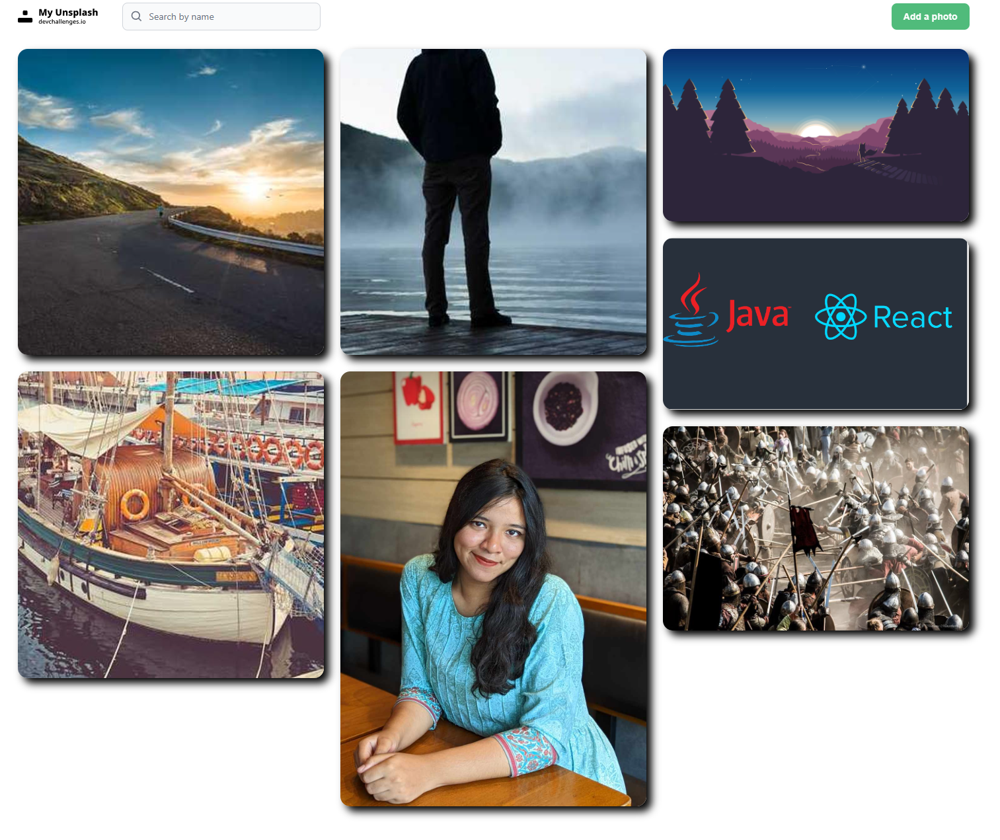
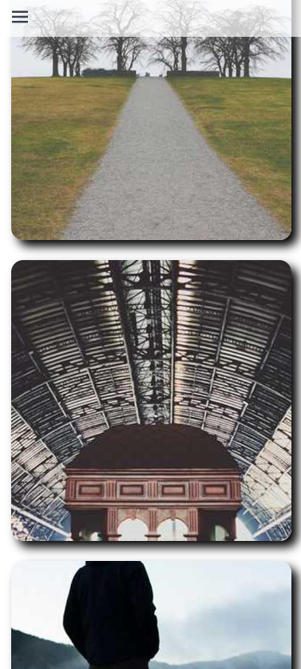

<!-- Please update value in the {}  -->

<h1 align="center">My Unsplash</h1>

<div align="center">
   Solution for a challenge from  <a href="http://devchallenges.io" target="_blank">Devchallenges.io</a>.
</div>

<div align="center">
  <h3>
    <a href="https://un-splash-gallery.vercel.app">
      Demo
    </a>
    <span> | </span>
    <a href="https://github.com/Akib-Raihan-4/unSplash-Gallery">
      Solution
    </a>
    <span> | </span>
    <a href="https://devchallenges.io/challenges/rYyhwJAxMfES5jNQ9YsP">
      Challenge
    </a>
  </h3>
</div>

<!-- TABLE OF CONTENTS -->

## Table of Contents

- [Overview](#overview)
  - [Built With](#built-with)
- [Features](#features)
- [How to use](#how-to-use)
- [Contact](#contact)


<!-- OVERVIEW -->

## Overview






Introduce your projects by taking a screenshot or a gif. Try to tell visitors a story about your project by answering:

- Where can I see your demo?
https://un-splash-gallery.vercel.app
- What was your experience?
It was really good !! I have seen bunch of tutorials and able to build my own API. It was challenging for me, but I had fun 😁, this is my smile literally.
- What have you learned/improved?
I got to learn about RestAPI and how to deploy this API. And as usual learned about the frontend stuffs more, used Tailwind Flowbite for the first time, and it works so well !!
- Your wisdom? :)
Same wisdom as always: "Just keep messing around with the problems, you will eventually get your answer, you just have to be patient."

### Built With

<!-- This section should list any major frameworks that you built your project using. Here are a few examples.-->

- [React](https://reactjs.org/)
- [Node.js](https://vuejs.org/)
- [Express.js](https://vuejs.org/)
- [MongoDB Atlas](https://vuejs.org/)
- [Tailwind](https://tailwindcss.com/)

## Features

<!-- List the features of your application or follow the template. Don't share the figma file here :) -->

This application/site was created as a submission to a [DevChallenges](https://devchallenges.io/challenges) challenge. The [challenge](https://devchallenges.io/challenges/rYyhwJAxMfES5jNQ9YsP) was to build an application to complete the given user stories.

## How To Use

<!-- Example: -->

To clone and run this application, you'll need [Git](https://git-scm.com) and [Node.js](https://nodejs.org/en/download/) (which comes with [npm](http://npmjs.com)) installed on your computer. From your command line:

```bash
# Clone this repository
$ git clone https://github.com/your-user-name/your-project-name

# Install dependencies
$ npm install

# Run the app
$ npm start
```

## Contact

- I have no website but a Portfolio [Akib-Raihan-Portfolio](https://akib-raihan-portfolio.vercel.app/)
- GitHub [@Akib-Raihan-4](https://github.com/Akib-Raihan-4)
